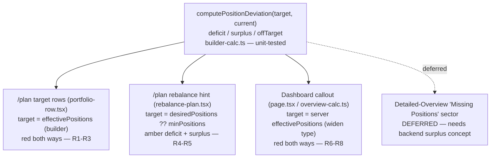

# Symmetric Target Deviation Signals - Plan

## Goal Capsule

- **Objective:** Make the app's "current vs target position count" signals treat over- and under-target the same — a deviation from the target is flagged in either direction, an exact match stays calm — on every client-fixable surface.
- **Product authority:** the user (single-user homeserver app; the sole user of `/plan` and the dashboard). Product scope was widened from two `/plan` surfaces to three surfaces after research; the user confirmed "go as wide as sensible."
- **Tail ownership:** standalone — this run implements, verifies locally, reviews, and ships.
- **Open blockers:** none. One surface (Detailed-Overview "Missing Positions" sector) is deferred to a backend follow-up; the simulator progress bar is deliberately left unchanged.
- **Product Contract preservation:** changed — original R1–R5 preserved verbatim; added R6–R8 (dashboard surface) and expanded Scope Boundaries per the confirmed scope widening.

---

## Product Contract

### Summary

Three client surfaces flag an under-target position count but stay silent when over target. Make each symmetric: the `/plan` target rows turn red for any mismatch, the `/plan` rebalance hint gains an amber surplus cue mirroring its deficit hint, and the dashboard "positions required" callout also surfaces over-target portfolios. All three read a target the code already has; no backend change is needed for them. One deeper surface (the Detailed-Overview "Missing Positions" sector) needs a server-emitted surplus concept and is deferred.

---

### Problem Frame

The signal is one-directional wherever it appears. On the `/plan` target rows, `N current` turns red only when current is *below* target — a portfolio targeting 1 while holding 6 reads as calm, one targeting 15 while holding 7 reads as alarm. The `/plan` rebalance plan shows "Needs N more positions" under target and nothing over. The dashboard home shows a red "BUILDER POSITIONS REQUIRED" callout listing only under-target portfolios. Over-shooting a target is as much a departure from plan as under-shooting it, so flagging one direction hides half the deviations. The asymmetry is duplicated across two pages, so fixing one surface without the others just moves the inconsistency around.

---

### Key Decisions

Product-level framing; implementation-level decisions live in the Planning Contract.

- **Target position count is an exact goal, not a floor.** Any mismatch between current and target is flagged; only an exact match is calm. Chosen over dropping the alarm or a positive-on-hit treatment.
- **Colour is consistent within each surface, not unified across surfaces.** Target rows red, rebalance amber, dashboard red — each surface keeps the colour it already uses, applied identically to over- and under-target. The user's principle is per-surface directional consistency, not one page-wide colour.
- **No magnitude/delta on the target-row label** — the colour change alone signals off-target. (The rebalance and dashboard cues already carry counts.)

---

### Requirements

**Target rows — `/plan`** (`frontend/src/app/(dashboard)/plan/portfolio-row.tsx`)

- R1. The `N current` label is highlighted whenever the current position count is not equal to the effective target, and is neutral only when they are exactly equal — replacing today's "highlight only when below target".
- R2. The highlight is the existing under-target red (`text-red`), applied identically for over- and under-target counts.
- R3. The label shows no magnitude or delta.

**Rebalance plan — `/plan`** (`frontend/src/app/(dashboard)/plan/rebalance-plan.tsx`)

- R4. A portfolio over its target position count shows a surplus cue that mirrors the existing "Needs N more positions" hint (amber left border, amber dot, tooltip naming the surplus count), so both directions are surfaced.
- R5. The rebalance cue uses its existing amber (`border-l-amber-500` border, `bg-amber` dot) in both directions.

**Dashboard callout — home** (`frontend/src/app/(dashboard)/page.tsx`, `frontend/src/lib/overview-calc.ts`, `frontend/src/types/overview.ts`)

- R6. The dashboard callout surfaces over-target portfolios alongside under-target ones, so the home page agrees with `/plan` on how over/under target reads.
- R7. Over/under status is computed from the portfolio's own target (`effectivePositions`, already present in the payload) rather than derived from the deficit-only "Missing Positions" sector, so a surplus is representable.
- R8. The callout keeps its existing red treatment, applied to both under- and over-target rows; an exact match contributes nothing.

---

### Acceptance Examples

Rows AE1–AE3 are the four from the reported screenshot (Target / current).

- AE1. **Covers R1, R2.** Target 1, current 6 (over). `6 current` is shown red. *(Today: neutral.)*
- AE2. **Covers R1.** Target 10, current 10 (exact). `10 current` is neutral.
- AE3. **Covers R1, R2.** Target 15, current 7 (under). `7 current` is shown red. *(Today: already red — behaviour unchanged, now for the "not equal" reason.)*
- AE4. **Covers R4, R5.** In the rebalance plan, a portfolio over its target shows the amber surplus border + dot + a "N over target" tooltip; a portfolio under target still shows "Needs N more positions"; an exact match shows neither.
- AE5. **Covers R6, R7, R8.** On the dashboard, a portfolio holding more than its effective target appears in the callout with its surplus count in red, next to any under-target portfolios; a portfolio exactly at target does not appear.

---

### Scope Boundaries

**Deferred to Follow-Up Work (needs backend):**

- The `/plan` Detailed-Overview "Missing Positions" sector (`detailed-overview.tsx:228`). It renders a server-computed, deficit-only sector; representing a surplus there requires `rebalance_service` / `allocation_service` to emit an over-target/surplus concept. Open a separate follow-up (candidate for a tracked issue).

**Outside scope — deliberately left one-directional:**

- Simulator investment-progress (`simulator/investment-progress.tsx`) — value-vs-goal progress, where under-target is the normal in-progress state; its "over target" signal is correct progress semantics, not the same asymmetry.
- The Target-input amber warning (`portfolio-row.tsx:76`, `desiredPositions < minPositions`) — a lower-bound floor check; only "below the feasibility floor" is meaningful.
- The summary fill-to-target placeholder rows — a fill mechanic with no "over" case.
- Ceiling/limit checks that correctly fire one direction only: allocation over-budget (`simulator-header.tsx`), constraint/concentration violations (`constraint-warnings.tsx`, `page.tsx` ViolationPanel), rule-capped `is_capped` dots. These compare against a cap where only "over" matters.

---

### Dependencies / Assumptions

- "Exact match = calm" uses strict integer equality on position counts; no tolerance band.
- The `/simulator/portfolio-data` payload already carries `effectivePositions`/`desiredPositions`/`minPositions` per portfolio (built in `allocation_service.calculate_allocation_targets` at `app/services/allocation_service.py:388-391`, passed through unchanged by `generate_rebalancing_plan`). The dashboard's `RebalancerPortfolio` type simply omits them; the fix widens the type, it does not change the backend.
- The repo has no React-component test infrastructure (vitest `node` env, `src/**/*.test.ts` only, no RTL/jsdom). Behavioral logic is proven by extracting pure helpers and table-testing them — the convention set by plan `002` (commit `ab436e7`).

---

## Planning Contract

### Key Technical Decisions

- KTD1. **One shared, tested deviation helper.** All three surfaces compare a target position count against a current count. Extract a single pure `computePositionDeviation(target, current) → { deficit, surplus, offTarget }` into `frontend/src/lib/builder-calc.ts` and consume it from all three, so the "both directions" rule lives in one unit-tested place. `offTarget` drives the target-row red (R1); `deficit`/`surplus` drive the rebalance and dashboard cues. Guard: when `target` is null/undefined or `<= 0`, return all-zero / `offTarget:false`, preserving the existing `desired > 0` guard and the `effectivePositions ?? 1` floor.
- KTD2. **Dashboard is a type-widening, not a backend change.** Widen `RebalancerPortfolio` (`overview.ts`) with optional `effectivePositions?`/`desiredPositions?`/`minPositions?` (already in the raw JSON), then compute deficit *and* surplus from `effectivePositions` in `overview-calc.ts`, decoupling from the deficit-only "Missing Positions" sector.
- KTD3. **Mirror, don't restyle, the rebalance cue.** The surplus cue reuses the exact deficit block (`border-l-2 border-l-amber-500` row border, `bg-amber` dot, `Tooltip`) with a surplus guard and "N over target" copy — keeping that surface internally consistent.
- KTD4. **Colour per surface** (see Key Decision): target rows `text-red`, rebalance amber, dashboard red. No cross-surface unification.
- KTD5. **Two surfaces stay out** by design: the Detailed-Overview sector (backend-blocked, deferred) and the simulator progress bar (different semantics). See Scope Boundaries.

### High-Level Technical Design

One shared helper fans out to the three in-scope surfaces; the fourth is deferred.

Directional: each surface supplies its own `target`/`current`; the helper centralizes the deficit/surplus/off-target rule.

### Sequencing

U1 (helper + tests) first; U2, U3, U4 each depend on U1 and are otherwise independent (different files).

---

## Implementation Units

### U1. Shared position-deviation helper + tests

- **Goal:** One pure, tested function expressing the symmetric target-vs-current rule for all surfaces.
- **Requirements:** Foundation for R1, R4, R6.
- **Dependencies:** none.
- **Files:** `frontend/src/lib/builder-calc.ts` (add helper), `frontend/src/lib/__tests__/builder-calc.test.ts` (add cases).
- **Approach:** Add `computePositionDeviation(target: number | null | undefined, current: number): { deficit: number; surplus: number; offTarget: boolean }`. When `target == null || target <= 0` → `{ deficit: 0, surplus: 0, offTarget: false }`. Else `deficit = Math.max(0, target - current)`, `surplus = Math.max(0, current - target)`, `offTarget = target !== current`. Keep it dependency-free so `overview-calc.ts` can import it without a cycle; if a cycle appears, move it to a neutral module (e.g. a small `plan-calc.ts`) and note it.
- **Execution note:** Write the table test first and watch it fail before adding the function — mirrors `number-input-calc.test.ts`.
- **Patterns to follow:** `frontend/src/lib/__tests__/number-input-calc.test.ts` (exhaustive boundary table), `frontend/src/lib/__tests__/builder-calc.test.ts` (same positions domain).
- **Test scenarios:** under target (target 15, current 7 → deficit 8, surplus 0, offTarget true); over target (target 1, current 6 → deficit 0, surplus 5, offTarget true); exact (target 10, current 10 → all zero/false); `target = 0` and `target = null`/`undefined` → all zero, offTarget false; `current = 0` with target 5 → deficit 5, offTarget true.
- **Verification:** `cd frontend && npm test` passes with the new cases.

### U2. Symmetric off-target red on the `/plan` target rows

- **Goal:** Red on the `N current` label for any mismatch, not just under target.
- **Requirements:** R1, R2, R3.
- **Dependencies:** U1.
- **Files:** `frontend/src/app/(dashboard)/plan/portfolio-row.tsx`.
- **Approach:** Replace `const currentBelow = currentPositions < effectivePositions;` (line 77) with the helper's `offTarget` (`computePositionDeviation(effectivePositions, currentPositions).offTarget`). Apply the existing `text-red` (line 145) when `offTarget`, `text-muted-foreground` otherwise. No delta text. Rename the local from `currentBelow` to `currentOffTarget` for accuracy.
- **Patterns to follow:** the existing `desiredBelow`/`currentBelow` locals in the same file.
- **Test scenarios:** covered at the helper level (U1). `Test expectation: none at the component level` — no RTL/jsdom in the repo; behavioral proof is AE1–AE3 on `/plan` (manual, per Verification Contract).
- **Verification:** On `/plan`, the four AE rows render per AE1–AE3; `npm run lint` clean.

### U3. Amber surplus cue on the `/plan` rebalance plan

- **Goal:** Surface over-target portfolios in the rebalance plan, mirroring the deficit hint.
- **Requirements:** R4, R5.
- **Dependencies:** U1.
- **Files:** `frontend/src/app/(dashboard)/plan/rebalance-plan.tsx`.
- **Approach:** Derive both directions via the helper from `desired` (`p.desiredPositions ?? p.minPositions ?? 0`) and `currentPositions` (lines 229-233). Keep the existing deficit block (row border + dot + "Needs N more positions", lines 236-256). Add a mirrored surplus block: guard the row border with `surplus > 0`, the dot + tooltip with `surplus > 0 && (p.currentValue || 0) > 0`, tooltip text "N over target" (singular/plural like the deficit). Reuse `border-l-2 border-l-amber-500` and `bg-amber`.
- **Patterns to follow:** the deficit `Tooltip` block at `rebalance-plan.tsx:236-256`.
- **Test scenarios:** helper logic covered by U1. `Test expectation: none at the component level` — behavioral proof is AE4 (manual).
- **Verification:** A portfolio over target shows the amber surplus dot/tooltip; deficit and exact cases unchanged; `npm run lint` clean.

### U4. Symmetric dashboard "off-target" callout

- **Goal:** The dashboard callout surfaces over-target portfolios, computed from the real target.
- **Requirements:** R6, R7, R8.
- **Dependencies:** U1.
- **Files:** `frontend/src/types/overview.ts`, `frontend/src/lib/overview-calc.ts`, `frontend/src/lib/__tests__/overview-calc.test.ts` (new), `frontend/src/app/(dashboard)/page.tsx`.
- **Approach:** (1) Widen `RebalancerPortfolio` with optional `effectivePositions?`, `desiredPositions?`, `minPositions?` (present in the raw payload; see KTD2). (2) In `overview-calc.ts`, compute `current` = sum of non-"Missing Positions" sector position counts (as today), take `target = portfolio.effectivePositions`, and use the U1 helper for `deficit`/`surplus`. Return both under- and over-target portfolios (extend `MissingPortfolio`, or add a sibling type/field carrying `surplus_count`). Fall back to today's `current + missing` derivation only when `effectivePositions` is absent, so nothing regresses if the field is missing. (3) In `page.tsx` (lines 210-248), render over-target portfolios in the same red callout with an "N over target" line; keep the deficit rows as-is. Consider a neutral section heading covering both directions (implementation may keep "positions required" copy for deficits and add a short over-target line — copy is refinable, see Open Questions).
- **Patterns to follow:** existing `extractMissingPositions` (`overview-calc.ts:104-134`) and the callout markup (`page.tsx:210-248`); test shape from `builder-calc.test.ts`.
- **Test scenarios:** `extractPositionDeviations` (or the extended `extractMissingPositions`) — portfolio under target (effective 5, 3 current → 2 missing); over target (effective 1, 6 current → 5 surplus); exact (excluded); `effectivePositions` absent → falls back to sector-derived deficit-only behaviour, no surplus, no crash; empty/no portfolios → `[]`.
- **Verification:** `cd frontend && npm test` passes the new `overview-calc` cases; AE5 holds on the dashboard; `npm run lint` clean.

---

## Verification Contract

| Gate | Command | Applies to |
|---|---|---|
| Frontend unit tests (vitest, node env) | `cd frontend && npm test` | U1, U4 (pure helpers) |
| Lint | `cd frontend && npm run lint` | all units |
| Type check | `cd frontend && npm run build` (or `npx tsc --noEmit`) | U4 (type widening) |
| Full suite (sanity; backend unchanged) | `./test.sh` | whole change |
| Behavioral (no component-test infra) | Manual on `/plan` and `/` | AE1–AE5 |

Behavioral verification is required because the repo has no component-test harness: exercise `/plan` (target rows + rebalance plan, an over-target and an under-target portfolio) and the dashboard callout, matching AE1–AE5.

---

## Definition of Done

- All units complete; `computePositionDeviation` and the `overview-calc` deviation function are unit-tested and green.
- `npm test`, `npm run lint`, and the type check pass; `./test.sh` green.
- AE1–AE5 verified manually on `/plan` and the dashboard.
- No cross-surface colour unification introduced; the two out-of-scope surfaces (Detailed-Overview sector, simulator progress) are untouched.
- The backend follow-up for the Detailed-Overview "Missing Positions" sector is recorded (Scope Boundaries; create a tracked issue if desired).
- No dead-end/experimental code left in the diff.

---

## Sources / Research

Verified during planning (adversarial sweep + targeted reads):

- **Colour tokens** (`frontend/src/app/globals.css`): `text-red` = `--red` (`#FF5360` dark). Amber is split — `bg-amber` is the terminal token `--amber` (`#FFB020`), while `border-l-amber-500`/`text-amber-400` are Tailwind default numeric amber. The rebalance cue already mixes them (`border-l-amber-500` border + `bg-amber` dot); the surplus cue reuses the same classes.
- **Rebalance deficit block:** `rebalance-plan.tsx:229-256` — `desired`, `currentPositions`, `deficit` computed inline; border guarded by `deficit > 0`, dot/tooltip by `deficit > 0 && (p.currentValue || 0) > 0`; `TooltipProvider` wraps the whole table.
- **Target-field provenance (dashboard is client-fixable):** `app/services/allocation_service.py:388-391` builds `minPositions`/`desiredPositions`/`effectivePositions` per portfolio in the base path; `generate_rebalancing_plan` returns `{'portfolios': portfolios_with_targets}` unchanged; `overview.ts:57-64` `RebalancerPortfolio` omits the fields.
- **Test convention:** `frontend/vitest.config.ts` (node env, `src/**/*.test.ts` only); 11 pure-function tests under `frontend/src/lib/__tests__/`; no RTL/jsdom. Plan `002` (commit `ab436e7`) set the extract-inline-logic-into-`*-calc.ts`-and-table-test pattern followed here.
- **Adversarial sweep result:** confirmed the two `/plan` surfaces plus the dashboard callout and the Detailed-Overview sector share the under-only position-count asymmetry; the simulator has the opposite (value-vs-goal) asymmetry; ceiling/limit checks and the Target-input floor check are correctly one-directional; `portfolio-list.tsx` / `allocation-bar.tsx` already flag both directions.

---

## Outstanding Questions

**Deferred to Planning/Implementation (non-blocking):**

- Exact dashboard heading/copy when the callout carries both directions — keep "BUILDER POSITIONS REQUIRED" for deficits plus a separate over-target line, or use a neutral "off-target" heading. Default: keep existing copy for deficits, add a concise over-target line; refine at review.
- Exact surplus tooltip wording ("N over target" vs "N surplus"). Default: "N over target".
